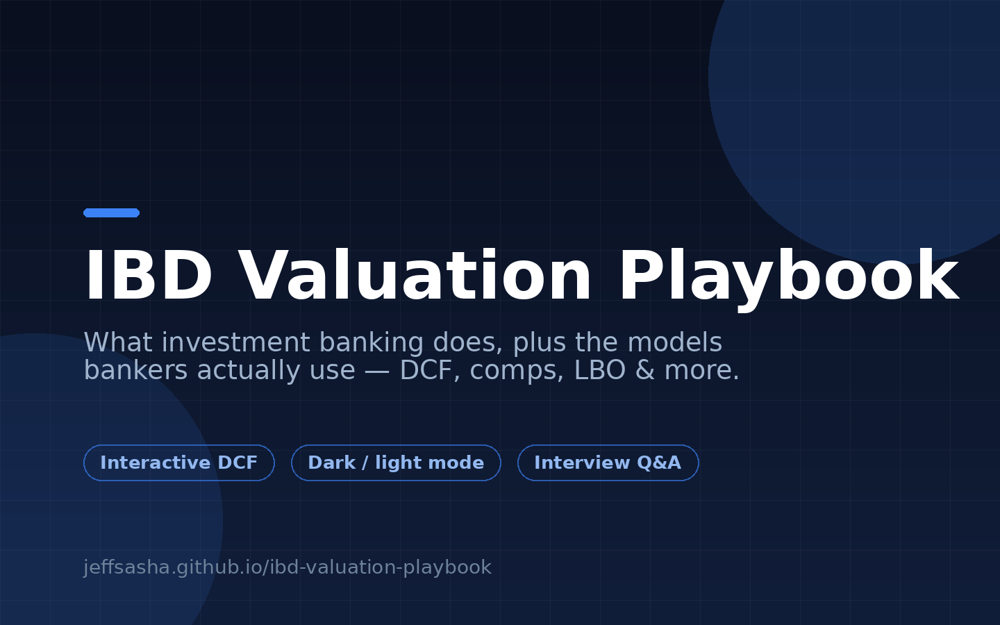

# IBD Valuation Playbook

An interactive introduction to what an Investment Banking Division (IBD) does, plus explorable versions of the valuation models bankers use every day.

**Live demo:** https://jeffsasha.github.io/ibd-valuation-playbook/



## What's inside

- **What IBD does** — M&A advisory, capital raising (ECM/DCM), restructuring, and how a deal process runs
- **Interactive DCF model** — a 5-year discounted cash flow with editable assumptions, live valuation output, and sensitivity analysis
- **Other core models** — trading comparables, precedent transactions, LBO, and merger (accretion/dilution) models
- **Interview Q&A** — common IBD interview questions with model answers
- **Valuation glossary** — key terms (EV, EBITDA, WACC, multiples...)

## Features

- Light / dark mode toggle
- Interactive charts — toggle between FCF and revenue views, inspect individual forecast years
- Export model outputs to CSV

## Run it locally

No build step — it's a single self-contained HTML file. Just open `index.html` in any modern browser, or serve it:

```bash
python3 -m http.server
```

## License

MIT — see [LICENSE](LICENSE).
